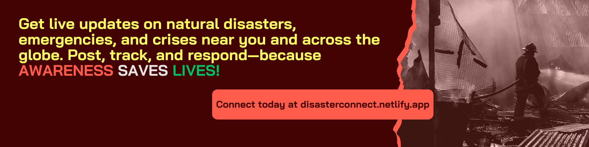

# Disaster Connect




## About Disaster Connect

**Disaster Connect** is a crowdsourced emergency response website that allows individuals to report live incidents using geo-tagged photos or videos. 

Users can upload reports about disasters happening in their vicinity, and others can view these updates in real-time. Additionally, users can specify a notification radius (e.g., 50 km) to receive alerts only for incidents within their selected area, ensuring they stay informed without unnecessary global notifications.

---

## Features

- **Live Disaster Reporting**: Users can post real-time disaster reports with geo-tagged images or videos.
- **Geo-Targeted Notifications**: Users can set a radius (e.g., 50 km) to receive disaster updates specific to their location.
- **Interactive Map**: A dynamic map displays all reported disasters, providing an easy-to-navigate interface.
- **Community Engagement**: Users can react as helpful for better coordination

---

## Tech Stack

- **Frontend**: React, Vite, TypeScript, Tailwind CSS, shadcn-ui
- **Backend**: Node.js, Express, MongoDB
- **Maps & Location Services**: Google Maps API for geo-tagging and interactive map integration
- **Notifications**: Web push notifications for real-time updates

---

## Installation & Setup

Follow these steps to run Disaster Connect locally:

### Prerequisites
- Node.js & npm installed ([Install via nvm](https://github.com/nvm-sh/nvm#installing-and-updating))
- MongoDB instance running locally or a cloud database (MongoDB Atlas recommended)

### Steps
```sh
# Step 1: Clone the repository
git clone <YOUR_GIT_URL>

# Step 2: Navigate to the project directory
cd disaster-connect

# Step 3: Install dependencies
npm install

# Step 4: Set up environment variables (.env file)
# Example:
# MONGO_URI=<your_mongodb_connection_string>
# MAPS_API_KEY=<your_google_maps_api_key>

# Step 5: Start the development server
npm run dev
```

---

## Usage

1. **Sign Up & Login**: Create an account or log in to start reporting or viewing disaster updates.
2. **Report an Incident**: Click on "Report Disaster," add location details, upload images/videos, and submit.
3. **View Nearby Disasters**: Set your preferred notification radius and see live updates within your range.
4. **Engage with Reports**: Comment, share, and react to disaster reports to help spread awareness.

---

## Deployment

Disaster Connect is deployed on:
- **Netlify** 


Example deployment steps:
```sh
# Deploy frontend to Netlify
netlify deploy

# Deploy backend to Heroku
heroku create
heroku git:remote -a <your-heroku-app-name>
git push heroku main
```

---

## Contribution Guidelines

Contributions are welcome! If you would like to contribute:
1. Fork the repository
2. Create a new branch (`git checkout -b feature-branch`)
3. Make your changes and commit (`git commit -m "Added new feature"`)
4. Push to your branch (`git push origin feature-branch`)
5. Open a Pull Request

---

## License

This project is licensed under the **MIT License**.

---

## Contact

For questions, suggestions, or collaborations, feel free to reach out:
- **Email**: [2516abhi43@gmail.com](mailto:2516abhi43@gmail.com)


